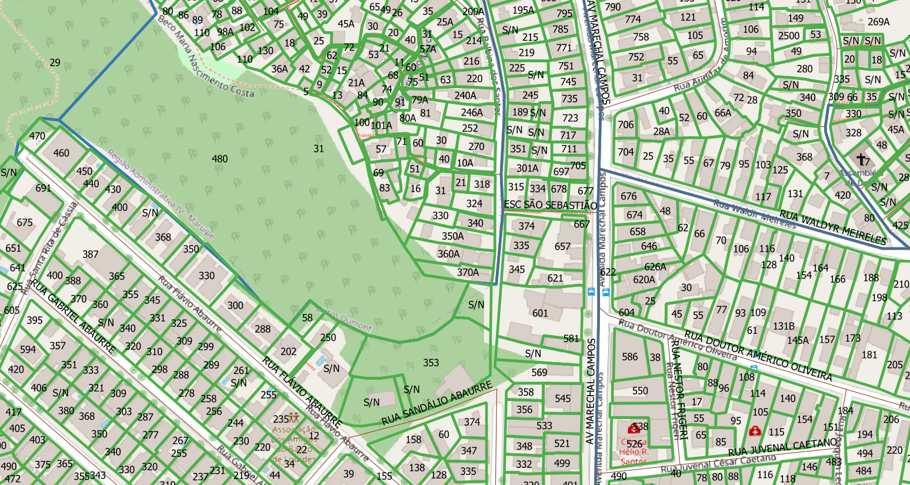

# Tarefas

# Extração
Abaixo os passos para extração por tipo de dado relevante.

## Lotes
SRID:  31999
1. Abrir `lote.zip`.
2. Selecionar arquivos `lote.*`.
3. Copiar arquivos selecionados para diretório alvo.

### Dados relevantes
Colunas:
* `logradouro` (string): nome do logradouro (R, AV, TR etc) em caixa baixa.
* `numero` (string): número predial.
* `bairro` (string): nome do bairro.

## Eixos
SRID: 31999
1. Abrir `eixo_logradouro.zip`.
2. Selecionar arquivos `eixo_logradouro.*`.
3. Copiar arquivos selecionados para diretório alvo.

### Dados relevantes
Colunas:
* `nome` (string): nome de logradouro (R, AV, TR etc) em caixa alta.
* `bairro_1` (string): nome do bairro.
* `bairro_2` (string): nome do bairro em caso de via em divisa de bairro.`

## Bairros
SRID: 31999
1. Abrir `bairros.zip`.
2. Selecionar arquivos `bairros.*`.
3. Copiar arquivos selecionados para diretório alvo.

### Dados relevantes
Colunas:
* `nome` (string): nome do bairro.

## Outros
O arquivo `eixo_logradouro.zip` inclui desenho detalhado das vias e o arquivo `edificacao.zip` inclui o desenho de edificação.

# Evidências de teste
Teste no QGIS:

# Make

Para gerar todos os layers aqui descritos,  `make all_layers`. Os dados "originais filtrados" serão todos gravados nas tabelas `ingest.layer_file` e `ingest.feature_asis`.

Para a geração de um só layer ou baixando dados em outra origem, ou usando uma base diferente da `ingest1`, usar demais parâmetros. Exemplo: `make pg_db=ingest2 orig=/tmp/sandOrig nsvia_full`.
