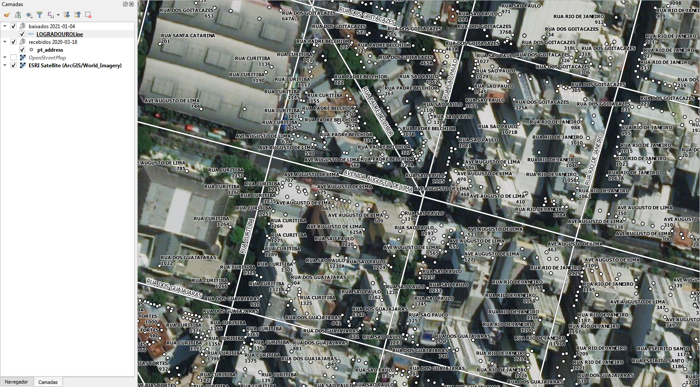

# Extração
Abaixo os passos para extração por tipo de dado relevante.

## Pontos de endereço
SRID: 31983
1. Abrir `ENDERECO.csv.zip`.
2. Selecionar arquivo `ENDERECO.csv`.
3. Copiar arquivo selecionado para diretório alvo.

### Dados relevantes
Colunas da camada `pt_address`:
* `SIGLA_TIPO_LOGRADOURO` (string): tipo de logradouro em caixa alta, abreviado (R, AVE, ROD).
* `NOME_LOGRADOURO` (string): nome do logradouro em caixa alta.
* `NUMERO_IMOVEL` (int): número predial.
* `LETRA_IMOVEL` (string): letra do número predial (e.g. 16A, 16B)
* `GEOMETRIA` (geometria formato "Well-known text" (WKT)): sequência de tipo de geometria, coordenada N, coordenada L.
* `LESTE` (string): coordenada leste, separador decimal por vírgula.
* `NORTE` (string): coordenada norte, separador decimal por vírgula.

### Expressões
Expressão para construir a string do nome do logradouro:

`SIGLA_TIPO_LOGRADOURO + ' ' + NOME_LOGRADOURO`

Expressão para construir a string de número predial:

`NUMERO_IMOVEL + if(LETRA_IMOVEL,LETRA_IMOVEL,'')`

## Evidências de teste
Teste no QGIS:

------

## Reprodutibilidade
Os dados de https://github.com/AddressForAll/in-BR foram gerados partir dos seguintes comandos definidos pelo `makefile`: 

* Pontos de endereço: `make etl_toPgis_endereco`
* Eixos de via: pendente

