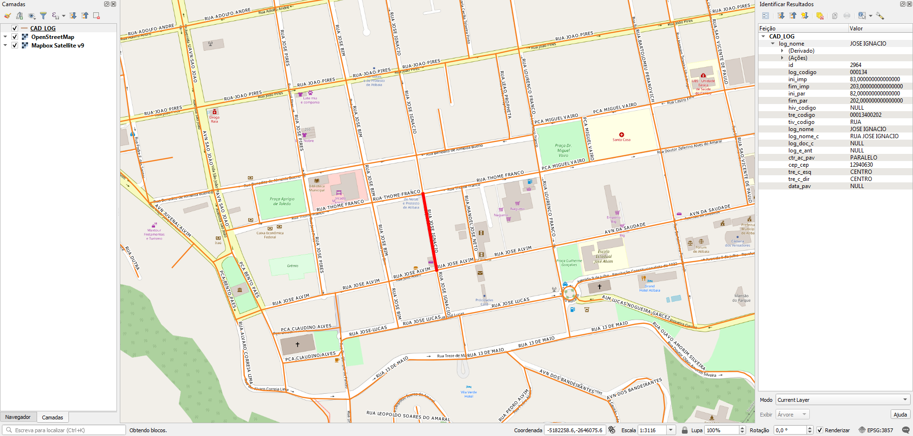

## Lotes
A prefeitura entregou somente os lotes da área central da cidade. Eles estão em processo de recuperar o geoprocessamento deles.

Como alternativa, as edificações possuem a numeração predial.

# Tarefas
## 1. Atribuir nome de logradouro nos lotes
Os lotes possuem somente numeração predial.

(!!! a escrever quando chegar todos os lotes !!!)

## 2. Gerar ponto de endereço na testada do lote
Procedimento usando PostGIS com script desenvolvido pelo A4A.

Cada ponto terá os dados:
* Nome do logradouro
* Número predial

# Extração
Abaixo os passos para extração por tipo de dado relevante.

## Edificações
SRID: 3857
1. Abrir `edificacoes.zip`.
2. Selecionar arquivos `edificacoes\edificacoes.*`.
3. Copiar arquivos selecionados para diretório alvo.

### Dados relevantes
Colunas:
* `numero` (string): número predial.

## Eixos
SRID: 29193
1. Abrir `logradouros.zip`.
2. Selecionar arquivos `logradouros\CAD_LOG.*`.
3. Copiar arquivos selecionados para diretório alvo.

### Dados relevantes
Colunas:
* `tiv_codigo` (string): tipo de via abreviado em caixa alta (AV).
* `log_nome` (string): nome de logradouro em caixa alta (RIO BRANCO).
* `log_nome_c` (string): tipo de via abreviado e nome de logradouro em caixa alta (AV RIO BRANCO).
* `ini_imp` (real): numeração inicial - lado ímpar.
* `fim_imp` (real): numeração final - lado ímpar.
* `ini_par` (real): numeração inicial - lado ímpar.
* `fim_par` (real): numeração final - lado ímpar.

## Lotes
SRID: 29193
1. Abrir `lotes.zip`.
2. Selecionar arquivos `lotes\lotes.*`.
3. Copiar arquivos selecionados para diretório alvo.

### Dados relevantes
Colunas:
* `num` (string): número predial.

# Evidências de teste
Teste no QGIS:

