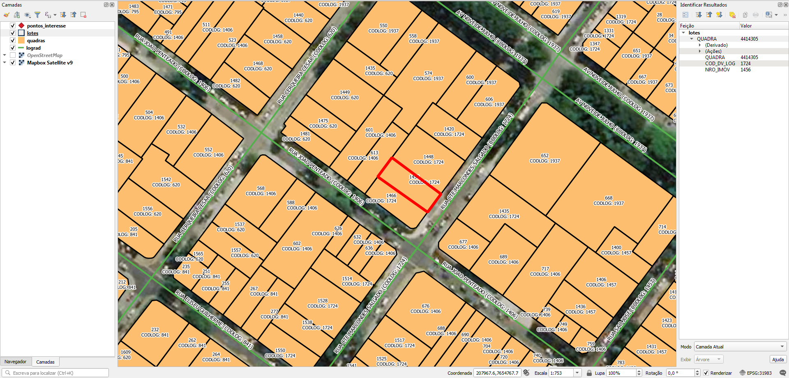

# Tarefas
## 1. Atribuir nome de logradouro nos lotes
Os lotes possuem somente numeração predial e o código de logradouro ao qual o lote pertence.

Atribuir o nome do logradouro nos lotes usando o código de logradouro como um DE-PARA. O código de logradouro está presente nos lotes e nos eixos de vias, na coluna `COD_DV_LOG` de ambos. Ver [Extração](#Extração).

## 2. Gerar ponto de endereço na testada do lote
Procedimento usando PostGIS com script desenvolvido pelo A4A.

Cada ponto terá os dados:
* Nome do logradouro
* Número predial

# Extração
Abaixo os passos para extração por tipo de dado relevante.

## Eixos
SRID: 31983
1. Abrir `recebidos_2020-11-11.zip`.
2. Selecionar arquivos `lograd.*`.
3. Copiar arquivos selecionados para diretório alvo.

### Dados relevantes
Colunas da camada `lograd`:
* `NOME_LOGR` (string): tipo e nome do logradouro em caixa alta. O tipo de logradouro está abreviado.
* `COD_DV_LOG` (real): código do logradouro.

## Lotes
SRID: 31983
1. Abrir `recebidos_2020-11-11.zip`.
2. Selecionar arquivos `lotes.*`.
3. Copiar arquivos selecionados para diretório alvo.

### Dados relevantes
Colunas da camada `lotes`:
* `NRO_IMOV` (int): número predial. Lotes sem número são representados por 0 ou 99999.
* `COD_DV_LOG` (int): código do logradouro.

## Quadras
SRID: 31983
1. Abrir `recebidos_2020-11-11.zip`.
2. Selecionar arquivos `quadras.*`.
3. Copiar arquivos selecionados para diretório alvo.

### Dados relevantes
Colunas da camada `quadras`:
* `QUADRA` (string): número de quadra.

## Outros
Outros dados:
* Pontos de interesse: pontos turísticos e equipamentos de cultura e lazer.

(!!! Havendo outros projetos, esta seção será detalhada !!!)

# Evidências de teste
Teste no QGIS:

------

## Makefile e resumo dos resultados

O resumo de todos os dados deste README  encontra-se no arquivo [`make_conf.yaml`](make_conf.yaml). Ele deu origem ao *makefile* que pode ser utilizado para reproduzir no PostgreSQL os layers descritos. Para utilizar basta rodar o comando `make all_layers`. Sumarização dos *layers* resultantes desse processo:

<table><caption>Package 058 version 1, BR-SP-RibeiraoPreto</caption><tr>
<td><b>block_full</b> (quadras)</td>
<td><b>Quantity</b>: 10921 polygons &#160;&#160;&#160; bbox_km2: 527 &#160;&#160;&#160; Size: 205 km2
 <b>Distribution</b>: <code>6uj</code>: 27%, <code>6ujzx</code>: 14%, <code>6un</code>: 21%, <code>6unp</code>: 12%, <code>6unp2</code>: 12%, <code>6unp8</code>: 13%, <code>6uq</code>: 0%.
 <b>Package</b> file: <a href="http://preserv.addressforall.org/download/6cd0d4b475e61b8cbd078787ea8b38ebdd051a1def026ca476d4a83d40354738.zip"><code>6cd0d4b475e61b8cbd078787ea8b38ebdd051a1def026ca476d4a83d40354738.zip</code></a>
 Sub-file: <b>shp</b> with MD5 <code>265d55a2b44626d5ea4fbe98ee03ea88</code> (14911076 bytes modifyed in 2020-09-10)
</td>
</tr><tr>
<td><b>parcel_ext</b> (lotes)</td>
<td><b>Quantity</b>: 227146 polygons &#160;&#160;&#160; bbox_km2: 520 &#160;&#160;&#160; Size: 194 km2
 <b>Distribution</b>: <code>6uj</code>: 7%, <code>6ujzr</code>: 12%, <code>6ujzx</code>: 18%, <code>6ujzz</code>: 10%, <code>6un</code>: 40%, <code>6unp8</code>: 13%, <code>6uq</code>: 0%.
 <b>Package</b> file: <code>6cd0d4b475e61b8cbd078787ea8b38ebdd051a1def026ca476d4a83d40354738.zip</code>
 Sub-file: <b>shp</b> with MD5 <code>b8b91da44d8b60eaf61e412c5bd19c56</code> (43519580 bytes modifyed in 2020-09-10)
</td>
</tr><tr>
<td><b>via_full</b> (eixos)</td>
<td><b>Quantity</b>: 32119 segments &#160;&#160;&#160; bbox_km2: 765 &#160;&#160;&#160; Size: 3256 km
 <b>Distribution</b>: <code>6u</code>: 23%, <code>6uj</code>: 11%, <code>6ujz</code>: 19%, <code>6ujzp</code>: 3%, <code>6un</code>: 12%, <code>6unp</code>: 25%, <code>6unp3</code>: 3%, <code>6unp9</code>: 3%.
 <b>Package</b> file: <code>6cd0d4b475e61b8cbd078787ea8b38ebdd051a1def026ca476d4a83d40354738.zip</code>
 Sub-file: <b>shp</b> with MD5 <code>d841935620ec6575d89203e727c520c0</code> (6956252 bytes modifyed in 2020-09-10)
</td>
</tr></table>
